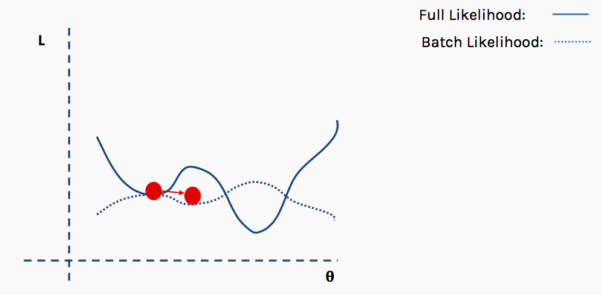

footer:
autoscale: true


---

#[fit] Ai 1

---

#[fit] Losses,
#  and 
#[fit] Learning

---

##[fit] Minimize
##[fit] Cost

---


---


## Regression: continuous prediction

- how many dollars will you spend?
- what is your creditworthiness
- how many people will vote for Bernie t days before election
- use to predict probabilities for classification
- causal modeling in econometrics


---


Linear Regression

$$\hat{y} = f_\theta (x) =\theta^T x$$

Cost Function:

$$R(\theta) = \frac{1}{2} \sum_{i=1}^m (f_\theta (x^{(i)}-y^{(i)})^2$$

###[fit] MINIMIZE SQUARED ERROR. Its Convex!

---


---

## Gradient ascent (descent)

basically go opposite the direction of the derivative.

Consider the objective function: $$ J(x) = x^2-6x+5 $$

```python
gradient = fprime(old_x)
move = gradient * step
current_x = old_x - move
```


---

## good step size


---

## too big step size


---

## too small step size


---

## Gradient Descent

$$\theta := \theta - \eta \nabla_{\theta} R(\theta) = \theta -\eta \sum_{i=1}^m \nabla R_i(\theta)$$

where $$\eta$$ is the learning rate.

ENTIRE DATASET NEEDED

```python
for i in range(n_epochs):
  params_grad = evaluate_gradient(loss_function, data, params)
  params = params - learning_rate * params_grad`
```

---

## Linear Regression: Gradient Descent

$$\theta_j := \theta_j + \alpha \sum_{i=1}^m (y^{(i)}-f_\theta (x^{(i)})) x_j^{(i)}$$


---

## Stochastic Gradient Descent

$$\theta := \theta - \alpha \nabla_{\theta} R_i(\theta)$$


ONE POINT AT A TIME

For Linear Regression: 

$$\theta_j := \theta_j + \alpha (y^{(i)}-f_\theta (x^{(i)})) x_j^{(i)}$$

```python
for i in range(nb_epochs):
  np.random.shuffle(data)
  for example in data:
    params_grad = evaluate_gradient(loss_function, example, params)
    params = params - learning_rate * params_grad
```

---

Mini-Batch SGD (the most used)

$$\theta := \theta - \eta \nabla_{\theta} J(\theta; x^{(i:i+n)}; y^{(i:i+n)})$$

```python
for i in range(mb_epochs):
  np.random.shuffle(data)
  for batch in get_batches(data, batch_size=50):
    params_grad = evaluate_gradient(loss_function, batch, params)
    params = params - learning_rate * params_grad
```

---
[.autoscale: true]

## Mini-Batch: do some at a time

- the risk surface changes at each gradient calculation
- thus things are noisy
- cumulated risk is smoother, can be used to compare to SGD
- epochs are now the number of times you revisit the full dataset
- shuffle in-between to provide even more stochasticity

---



---


---

#[fit] Ok, so where did this
#[fit] Mean Squared Loss
#[fit] come from?

---

## Gaussian Distribution assumption !


---

## Gaussian Distribution assumption

$$\renewcommand{\v}[1]{\mathbf #1}$$
Each $$y_i$$ is gaussian distributed with mean  $$\mathbf{w}\cdot\mathbf{x}_i$$ (the y predicted by the regression line) and variance $$\sigma^2$$:


$$
\renewcommand{\v}[1]{\mathbf #1}
y_i \sim N(\v{w}\cdot\v{x_i}, \sigma^2) .$$

$$N(\mu, \sigma^2) = \frac{1}{\sigma\sqrt{2\pi}} e^{-(y - \mu)^2 / 2\sigma^2},$$


---

We can then write the likelihood:

$$
\renewcommand{\v}[1]{\mathbf #1}
\cal{L} = p(\v{y} | \v{x}, \v{w}, \sigma) = \prod_i p(\v{y}_i | \v{x}_i, \v{w}, \sigma)$$


$$\renewcommand{\v}[1]{\mathbf #1}
\cal{L} =  (2\pi\sigma^2)^{(-n/2)} e^{\frac{-1}{2\sigma^2} \sum_i (y_i -  \v{w}\cdot\v{x}_i)^2} .$$

The log likelihood $$\ell$$ then is given by:

$$\renewcommand{\v}[1]{\mathbf #1}
\ell = \frac{-n}{2} log(2\pi\sigma^2) - \frac{1}{2\sigma^2}  \sum_i (y_i -  \v{w}\cdot\v{x}_i)^2 .$$

---

## Maximize $$\ell$$ ?

## No.  Minimize $$-\ell$$ using Gradient Descent!

If all you care for are the parameters $$w$$, then:

##Minimize Loss or Cost:

$$Loss = \frac{1}{N} \sum_i (y_i -  \v{w}\cdot\v{x}_i)^2 .$$

---

## Where's the neural network?

Replace $$\v{w}\cdot\v{x}_i)^2$$ with $$NN(\v{w}\cdot\v{x}_i)^2)$$.

So:

$$Loss = \frac{1}{N} \sum_i (y_i -  NN\,(\v{w}\cdot\v{x}_i)^2) .$$

---

## The Loss is now NOT CONVEX!


---

#[fit]CLASSIFICATION

- will a customer churn?
- is this a check? For how much?
- a man or a woman?
- will this customer buy?
- do you have cancer?
- is this spam?
- whose picture is this?
- what is this text about?[^j]


[^j]:image from code in http://bit.ly/1Azg29G

---

## 1-D classification problem


---

## 1-D Using Linear regression


---

##[fit] MLE for Logistic Regression

- example of a Generalized Linear Model (GLM)
- "Squeeze" linear regression through a **Sigmoid** function
- this bounds the output to be a probability

---

## Sigmoid function

This function is plotted below:

```python
h = lambda z: 1./(1+np.exp(-z))
zs=np.arange(-5,5,0.1)
plt.plot(zs, h(zs), alpha=0.5);
```


Identify: $$\renewcommand{\v}[1]{\mathbf #1} z = \v{w}\cdot\v{x}$$ and $$ \renewcommand{\v}[1]{\mathbf #1} h(\v{w}\cdot\v{x})$$ with the probability that the sample is a '1' ($$y=1$$).

---

Then, the conditional probabilities of $$y=1$$ or $$y=0$$ given a particular sample's features $$\renewcommand{\v}[1]{\mathbf #1} \v{x}$$ are:

$$\begin{eqnarray}
\renewcommand{\v}[1]{\mathbf #1}
P(y=1 | \v{x}) &=& h(\v{w}\cdot\v{x}) \\
P(y=0 | \v{x}) &=& 1 - h(\v{w}\cdot\v{x}).
\end{eqnarray}$$

These two can be written together as

$$\renewcommand{\v}[1]{\mathbf #1} P(y|\v{x}, \v{w}) = h(\v{w}\cdot\v{x})^y \left(1 - h(\v{w}\cdot\v{x}) \right)^{(1-y)} $$

BERNOULLI!!

---

Multiplying over the samples we get:

$$\renewcommand{\v}[1]{\mathbf #1} P(y|\v{x},\v{w}) = P(\{y_i\} | \{\v{x}_i\}, \v{w}) = \prod_{y_i \in \cal{D}} P(y_i|\v{x_i}, \v{w}) = \prod_{y_i \in \cal{D}} h(\v{w}\cdot\v{x_i})^{y_i} \left(1 - h(\v{w}\cdot\v{x_i}) \right)^{(1-y_i)}$$

Indeed its important to realize that a particular sample can be thought of as a draw from some "true" probability distribution.

 **maximum likelihood** estimation maximises the **likelihood of the sample y**, or alternately the log-likelihood,

$$\renewcommand{\v}[1]{\mathbf #1} {\cal L} = P(y \mid \v{x},\v{w}).$$ OR $$\renewcommand{\v}[1]{\mathbf #1} \ell = log(P(y \mid \v{x},\v{w}))$$

---

Thus

$$\renewcommand{\v}[1]{\mathbf #1} \begin{eqnarray}
\ell &=& log\left(\prod_{y_i \in \cal{D}} h(\v{w}\cdot\v{x_i})^{y_i} \left(1 - h(\v{w}\cdot\v{x_i}) \right)^{(1-y_i)}\right)\\
                  &=& \sum_{y_i \in \cal{D}} log\left(h(\v{w}\cdot\v{x_i})^{y_i} \left(1 - h(\v{w}\cdot\v{x_i}) \right)^{(1-y_i)}\right)\\
                  &=& \sum_{y_i \in \cal{D}} log\,h(\v{w}\cdot\v{x_i})^{y_i} + log\,\left(1 - h(\v{w}\cdot\v{x_i}) \right)^{(1-y_i)}\\
                  &=& \sum_{y_i \in \cal{D}} \left ( y_i log(h(\v{w}\cdot\v{x})) + ( 1 - y_i) log(1 - h(\v{w}\cdot\v{x})) \right )
\end{eqnarray}$$

---
[.autoscale: true]

## Logistic Regression: NLL

The negative of this log likelihood (NLL), also called *cross-entropy*.

$$\renewcommand{\v}[1]{\mathbf #1} NLL = - \sum_{y_i \in \cal{D}} \left ( y_i log(h(\v{w}\cdot\v{x})) + ( 1 - y_i) log(1 - h(\v{w}\cdot\v{x})) \right )$$

This loss is convex. Many ways can be chosen to minimize it, but we can just use gradient descent :-)

---

## 1-D Using Logistic regression


---

## In diagram:


---

## Softmax formulation

- Identify $$p_i$$ and $$1-p_i$$ as two separate probabilities constrained to add to 1. That is $$p_{1i} = p_i ; p_{2i} = 1 - p_i. $$

- $$\renewcommand{\v}[1]{\mathbf #1}
p_{1i} = \frac{e^{\v{w_1} \cdot \v{x}}}{e^{\v{w_1} \cdot \v{x}} + e^{\v{w_2} \cdot \v{x}}}$$

- $$\renewcommand{\v}[1]{\mathbf #1}
p_{2i} = \frac{e^{\v{w_2} \cdot \v{x}}}{e^{\v{w_1} \cdot \v{x}} + e^{\v{w_2} \cdot \v{x}}}$$
- Can translate coefficients by fixed amount $$\psi$$ without any change

---

## NLL  for Softmax

$${\cal L} = \prod_i p_{1i}^{\mathbb1_1(y_i)} p_{2i}^{\mathbb1_2(y_i)}$$

$$NLL = -\sum_i \left( \mathbb1_1(y_i) log(p_{1i}) + \mathbb1_2(y_i) log(p_{2i}) \right)$$

---

## Units diagram for Softmax


---

## Write it in Layers


---

## Equations, layer by layer

$$\renewcommand{\v}[1]{\mathbf #1}
\v{z}^1 = \v{x_i}$$

$$\renewcommand{\v}[1]{\mathbf #1}
\v{z}^2 = (z^2_1, z^2_2) = (\v{w_1} \cdot \v{x_i}, \v{w_2} \cdot \v{x_i}) = (\v{w_1} \cdot \v{z^1_i}, \v{w_2} \cdot \v{z^1_i})$$

$$\renewcommand{\v}[1]{\mathbf #1}
\v{z}^3 = (z^3_1, z^3_2) = \left( LSM_1(z^2_1, z^2_2), LSM_2(z^2_1, z^2_2) \right)$$

$$\renewcommand{\v}[1]{\mathbf #1}
z^4 = NLL(\v{z}^3) = NLL(z^3_1, z^3_2) = - \sum_i \left( \mathbb1_1(y_i)z^3_1(i) + \mathbb1_2(y_i)z^3_1(i) \right)$$

---

## Dude, where is my network?

$$\renewcommand{\v}[1]{\mathbf #1}
\v{z}^2 = (z^2_1, z^2_2) = (NN(\v{w_1} \cdot \v{x_i}), NN(\v{w_2} \cdot \v{x_i})) = (NN(\v{w_1} \cdot \v{z^1_i}), NN(\v{w_2} \cdot \v{z^1_i}))$$

Simply replace the linear regression here by a neural network.

Now find gradients for SGD.

---

#[fit]CLASSIFICATION

#[fit]BY LINEAR SEPARATION

#Which line?

- Different Algorithms, different lines.

- SVM uses max-margin[^j]


---


#DISCRIMINATIVE CLASSIFIER
$$P(y|x): P(male | height, weight)$$


---

## Discriminative Learning

- are these classifiers any good?
- they are discriminative and draw boundaries, but thats it
- could it be better to have a classifier that captured the generative process of the data?
- Thats Ai 2

---

## Calculating Gradients for learning: Backprop (Intuition)

---


---

## Simple MLP for regression


---


---

## Forward Pass

We want to obtain gradients. For example: $$\frac{\partial Cost}{\partial param}
 = \frac{\partial z^6}{\partial w_1}$$

First we do the **Forward Pass**. Say we have 1 sample: (x=0.1, y=5). Initialize
 $$b_1, w_1, b_2, w_2, w_{o1}, w_{o2}, b_{o}$$. Then, plugging in the numbers wi
ll give us some Cost ($$z^5, z^6$$).


---

## Backward Pass

Now it is time to find the gradients, for eg,  $$\frac{\partial z^6}{\partial w_1}$$

The basic idea is to gather all parts that go to $$w_1$$, and so on and so forth. Now we perform GD (SGD) with some learning rate.

The parameters get updated. Now we repeat the forward pass.

Thats it! Wait for convergence.


---

## Losses in Neural Nets


---

## How to fit?

Our recipe has been:

- Train a neural network until it overfits.
- Then add "regularization"

But what is **Regularization**.

Its a way to make parameters behave, to constrain them.

---

## Many styles of regularization

- Dropout
- L2/L1 Regularization: kernel regularization in Keras (also called weight decay)
- Early Stopping
- Simply add more data
- Data Augmentation

---

## Dropout


Dropout is a kind of pseudo layer.

- choose a probability $$p$$
- randomly sever $$p$$ of the connections from the previous layer in the training phase
- this forces other connections to take up the slack and prevents them from over-specializing
- in the testing phase multiply the learned weights with this probability but dont sever connections

---

## L2 Norm


---

## Early Stopping


---

##[fit] Optimization

---

# The workhorse: SGD

- has one parameter, the learning rate
- the learning rate is how much of the gradient to use in your parameter updates
- the more you use, the faster you can train, and thus you dont get stuck in local minima
- but if you keep it large you bounce around stochastically

---

# Messing with SGD

- it would be better to have a learning rate schedule, or adaptive learning rates, perhaps different for each parameter
- SGD oscillates in high curvature areas
- averaging the gradient: $$<g>$$ over a few steps helps as it eliminates oscillations
- momentum helps as well to keep you going straight down:
  
  $$v_{t+1} = \alpha v_t - \eta <g>_t, w_{t+1} = w_t + v$$


---

# Other Variants

- **Adagrad**: $$r_{t+1, j} = r_{t, j} + <g>_{tj}^2, w_{t+1} = w_t - \eta \frac{<g>_{tj}}{(\delta + \sqrt{r_{tj}})}$$ has greater progress along gently sloped directions
- **RMSprop** uses exponentially weighted average for gradient accumulation. Change to Adagrad: $$r_{t+1, j} = \rho r_{t, j} + (1 - \rho)<g>_{tj}^2$$
- **Adam** adds momentum to RMSprop works well in practice:

$$r_{t+1, j} = \rho_r r_{t, j} + (1 - \rho_r)<g>_{tj}^2$$,   $$v_{t+1, j} = \rho_v v_{t, j} + (1 - \rho_v)<g>_{tj}^2$$, $$ w_{t+1} = w_t - \eta \frac{v_{tj}}{(\delta + \sqrt{r_{tj}})}$$

---

## Other considerations 

- standardize your inputs(features) so no one input dominates
- we'll come back to Adam (later)
- parameter inittialization (Xavier vs He) (later)
- Batch normalization (later)